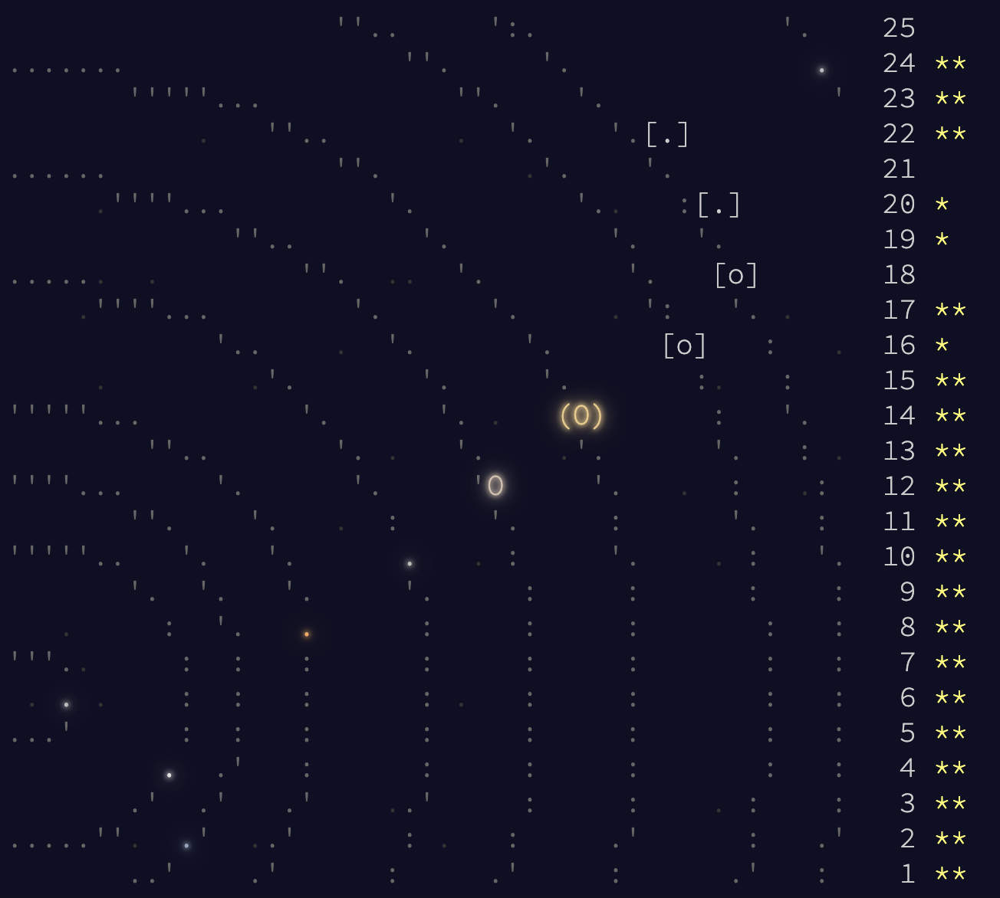

I got 41 stars:

Each day can be run independently (although many import other days). Some days
give both parts and some are split.

Day 16 part 2 and Day 18 part 1 have partial solutions. Note that day18.py
runs forever without finishing (unless you run it for a *really* long time).
